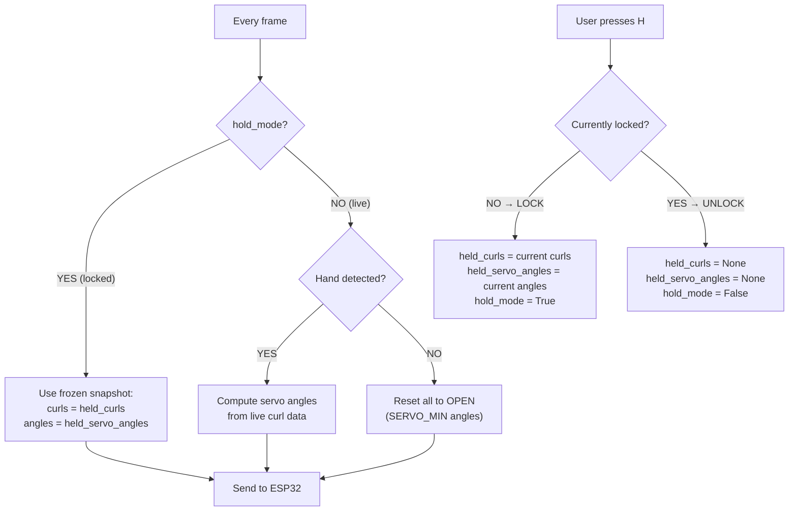

# InMoov Hand Control — Algorithm Deep Dive

Every algorithm in the system, explained with math and visuals.

---

## 1. Finger Curl Detection (Index, Middle, Ring, Pinky)

**File:** `python_client/hand_tracker.py` — `_compute_finger_curl()` (line 184–216)

**Goal:** Measure how bent a finger is → output 0% (straight) to 100% (fist).

**Method:** Compute the angle at each joint using the **dot product formula**.

```
     MCP ←── angle_pip ──→ DIP ←── angle_dip ──→ TIP
      ↑                     ↑                      ↑
  base joint          middle joint             fingertip
```

### The angle formula

Given 3 points **A → B → C**, the angle at **B**:

```
  BA = A - B
  BC = C - B
  cos(θ) = (BA · BC) / (|BA| × |BC|)
  θ = arccos(cos(θ))
```

```python
# hand_tracker.py — _angle_between() (line 356-385)
def _angle_between(a, b, c):
    ba = a - b
    bc = c - b
    cos_angle = dot(ba, bc) / (|ba| × |bc|)
    return degrees(arccos(cos_angle))
```

### Combining two joints

```python
avg_angle = 0.65 × angle_PIP + 0.35 × angle_DIP
```

PIP (knuckle) contributes **65%** because it has the largest range of motion. DIP (fingertip joint) contributes **35%**.

### Mapping angle → curl %

```python
curl = interp(avg_angle, [40°, 170°], [100%, 0%])
```

```
Angle:  170° (straight)  ──────────────  40° (fully bent)
Curl:     0% (open)      ──────────────  100% (closed)
```

---

## 2. Thumb Curl Detection (Hybrid Method)

**File:** `python_client/hand_tracker.py` — `_compute_thumb_curl()` (line 218–271)

The thumb moves differently (opposition, not just flexion), so it uses **two methods averaged 50/50**:

### Method A — Distance-based

```
normalized_dist = |thumb_tip − index_MCP| / |middle_MCP − wrist|
                   ↑ how far thumb is        ↑ hand size (for scale)
                     from index base

curl_dist = interp(normalized_dist, [0.15, 0.7], [100%, 0%])
```

- Thumb tip **near** index base → curled (100%)
- Thumb tip **far** from index base → open (0%)
- Dividing by hand size makes it work at any camera distance

### Method B — Angle-based

```
curl_angle = interp(angle_at_MCP, [60°, 160°], [100%, 0%])
```

### Combined

```python
curl = 0.5 × curl_dist + 0.5 × curl_angle
```

---

## 3. Wrist Rotation (3D Palm Roll Extraction)

**File:** `python_client/hand_tracker.py` — `_compute_wrist_rotation()` (line 273–354)

**Goal:** Detect forearm rotation (pronation/supination) — like turning a doorknob — and map it to the wrist servo (0°–180°).

**Challenge:** Simply measuring the wrist angle in 2D would conflate arm tilt with forearm roll. We isolate the **roll component** in 3D.

### Step 1 — Longitudinal axis

```
â = normalize(middle_MCP − wrist)   →   points "up" along the hand
```

### Step 2 — Cross-palm vector

```
c⃗ = pinky_MCP − index_MCP   →   points across the palm
```

### Step 3 — Project onto perpendicular plane

Remove the component along the hand axis so we only see the roll:

```
c⃗_perp = c⃗ − (c⃗ · â) × â
```

### Step 4 — Build reference axes (Gram-Schmidt)

```
r̂ = normalize( (1,0,0) − ((1,0,0)·â) × â )   →   "camera-right" reference
û = â × r̂                                        →   "camera-up" reference
```

If the hand axis is nearly parallel to camera-right, fall back to camera-up (0,−1,0).

### Step 5 — Compute roll angle

```
roll = atan2(c⃗_perp · û, c⃗_perp · r̂)
```

### Step 6 — Map to servo using cosine

```python
servo_angle = (cos(roll_rad) + 1.0) × 90.0    # Range: 0 … 180
```

| Hand orientation | roll (rad) | cos(roll) | Servo angle |
|-----------------|------------|-----------|-------------|
| Palm facing camera | 0 | 1.0 | **180°** |
| Hand sideways | ±π/2 | 0.0 | **90°** |
| Back of hand | ±π | −1.0 | **0°** |

The cosine mapping provides a smooth, continuous transition with no discontinuity at the ±180° wrap-around.

---

## 4. EMA Smoothing

**File:** `python_client/hand_tracker.py` — `process_frame()` (line 177–180)

Raw MediaPipe values jitter frame-to-frame. **Exponential Moving Average** smooths them:

```python
smoothed = α × raw + (1 - α) × previous_smoothed     # α = 0.35
```

```
α = 1.0  →  No smoothing (instant but jittery)
α = 0.35 →  Balanced (responsive + smooth)  ← default
α = 0.1  →  Heavy smoothing (laggy but very smooth)
```

Visually, if raw value jumps from 20 to 80 instantly:

```
Frame:    1     2     3     4     5     6     7
Raw:     80    80    80    80    80    80    80
Smooth:  41    54    63    70    74    77    79
         ↑ only jumps to 41 on first frame, then gradually catches up
```

---

## 5. Grip Protection — Compliance Zone (Cosine Easing)

**File:** `python_client/main.py` — `curl_to_servo_angle()` (line 88–129) and `GripController` (line 33–85)

**Goal:** Prevent crushing objects by capping how far fingers can close, with a smooth deceleration zone.

### The three zones

```
Curl %:  0%  ─────────────  55%  ─────────  75%  ─── 100%
         │   FREE ZONE      │  COMPLIANCE   │  BLOCKED
         │   (1:1 mapping)  │  (eased)      │  (capped)
                              ↑               ↑
                      (max_curl - compliance)  max_curl (= grip strength)
```

Example: NORMAL mode → strength=75%, compliance_zone=20%

### The cosine easing math

Inside the compliance zone (curl between 55% and 75%):

```python
zone_progress = (curl - 55) / 20          # 0.0 at entry → 1.0 at limit
easing = 0.5 × (1 - cos(π × progress))   # Cosine ease-in curve
effective_curl = 55 + 20 × easing
```

```
Input curl:      55%   60%   65%   70%   75%   80%   90%  100%
Effective curl:  55%   56%   60%   68%   75%   75%   75%   75%
                  ↑ barely moves at start    ↑ capped here
```

The cosine curve creates a **soft brake** — starts gentle, increases braking near the limit.

### Final servo angle mapping

```python
# After grip protection:
if not inverted:
    angle = interp(effective_curl, [0, 100], [SERVO_MIN, SERVO_MAX])
else:
    angle = interp(effective_curl, [0, 100], [SERVO_MAX, SERVO_MIN])
```

---

## 6. ESP32 Communication Filters

**File:** `python_client/esp32_client.py` — `send_all_servos()` (line 54–102)

### Rate limiter

```python
if (now - last_send_time) < 1/30:   # 33ms minimum interval
    return  # Skip this frame, too soon
```

At 60 FPS camera but 30 Hz send rate → only every other frame actually sends.

### Deadband filter

```python
max_change = max(|new_angle[finger] - old_angle[finger]|  for each finger)
if max_change < 2°:
    return  # Skip — nothing moved enough to matter
```

Prevents sending identical or nearly-identical commands.

---

## 7. ESP32 Firmware — Smooth Servo Interpolation

**File:** `esp32_firmware/esp32_hand_controller/esp32_hand_controller.ino` — `updateServos()` (line 86–128)

Runs every **20ms**. Instead of jumping to the target angle, the servo moves **at most 8° per step**:

```cpp
diff = target - current;
if (|diff| > 8)
    diff = sign(diff) × 8;    // Cap at 8°/step
current += diff;
```

```
Target jumps from 10° to 170° (160° gap):
Step:     0    1    2    3   ...  19    20
Current: 10°  18°  26°  34° ... 162°  170° ✓
                                      ↑ arrives in 20 steps = 400ms
```

### Firmware compliance zone

When the servo is **closing** (angle increasing) and within 20° of its target:

```cpp
// Linear speed reduction in compliance zone
factor = distance_to_target / 20;
speed = max(1, 1 + factor × (8 - 1));
```

```
Distance to target:  20°   15°   10°    5°    1°
Speed (°/step):       8     6     4     2     1
                      ↑ full speed          ↑ crawling (gentle contact)
```

---

## 8. Hold/Lock Algorithm

**File:** `python_client/main.py` — keyboard handler (line 1017–1034), mouse handler (line 849–864), main loop (line 948–972)



**Key insight:** The hold check runs **before** the hand-detection check. When locked, the entire live-tracking/reset path is bypassed.

---

## 9. PCA9685 PWM Tick Conversion

**File:** `esp32_firmware/esp32_hand_controller/esp32_hand_controller.ino` — `setServoImmediate()` (line 75–78)

```
angle (0-180°)  →  PWM ticks (102-512)  →  pulse width (500-2500µs)

                    PCA9685 at 50Hz:
                    Period = 20ms = 4096 ticks
                    1 tick ≈ 4.88µs

   0° → 102 ticks → 498µs   (MG996R minimum)
  90° → 307 ticks → 1499µs  (MG996R center)
 180° → 512 ticks → 2499µs  (MG996R maximum)
```

```cpp
pwm_tick = (angle * (512 - 102)) / 180 + 102;
pwm.setPWM(channel, 0, pwm_tick);
```

---

## Summary — Full Pipeline per Frame

```
Camera frame (BGR, 1280×720)
    │
    ├─ flip if mirror mode
    ├─ convert BGR → RGB
    │
    ▼
MediaPipe Hand Landmarker
    │
    ├─ detects 21 landmarks (x, y, z normalized)
    │
    ▼
Curl Computation (per finger)
    │
    ├─ Fingers: joint angles → weighted avg → map to 0-100%
    ├─ Thumb: distance + angle hybrid → 0-100%
    ├─ Wrist: 3D palm roll → cos mapping → 0-180°
    │
    ▼
EMA Smoothing (α = 0.35)
    │
    ├─ smoothed = 0.35 × raw + 0.65 × previous
    │
    ▼
Hold Check ─── if LOCKED → use frozen snapshot, skip below
    │
    ▼
Grip Protection
    │
    ├─ Cap curl at grip strength %
    ├─ Cosine easing in compliance zone
    │
    ▼
Servo Angle Mapping
    │
    ├─ interp(curl, [0,100], [SERVO_MIN, SERVO_MAX])
    ├─ handle inversion
    │
    ▼
Rate Limit (30 Hz) + Deadband (2°)
    │
    ▼
Serial/WiFi → "F90,10,45,30,10,90\n"
    │
    ▼
ESP32 Command Parser
    │
    ├─ sets targetAngle[] for each servo
    │
    ▼
Servo Update Loop (every 20ms)
    │
    ├─ move max 8°/step toward target
    ├─ compliance: slow down when closing + near target
    │
    ▼
PCA9685 → PWM pulse → MG996R servo moves
```
