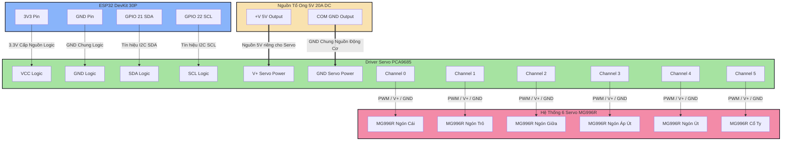

# Thông Số Thực Nghiệm & Thông Tin Sản Phẩm — InMoov Hand Robot

Tài liệu này tổng hợp **toàn bộ thông số kỹ thuật** trích xuất từ mã nguồn dự án, phục vụ cho việc xây dựng bảng đo đạc thực nghiệm và chụp ảnh sản phẩm.

---

## 1. Bảng 4.1 — Đánh giá Độ trễ & Tỷ lệ Mất gói tin theo Khoảng cách (WiFi TCP)

### Thông số hệ thống liên quan (từ mã nguồn)

| Thông số | Giá trị | File nguồn |
|----------|---------|------------|
| Giao thức truyền | **TCP (SOCK_STREAM)** | [esp32_client.py](file:///c:/ESP32_HandRobot_Inmoov/python_client/esp32_client.py#L273) |
| TCP Port | **8080** | [config.py](file:///c:/ESP32_HandRobot_Inmoov/python_client/config.py#L48) / [config.h](file:///c:/ESP32_HandRobot_Inmoov/esp32_firmware/esp32_hand_controller/config.h#L53) |
| ESP32 IP | **[ESP32 IP]** | [config.py](file:///c:/ESP32_HandRobot_Inmoov/python_client/config.py#L47) |
| WiFi SSID | **[WiFi SSID]** | [config.h](file:///c:/ESP32_HandRobot_Inmoov/esp32_firmware/esp32_hand_controller/config.h#L51) |
| WiFi Band | **2.4 GHz** (ESP32 không hỗ trợ 5 GHz) | [README.md](file:///c:/ESP32_HandRobot_Inmoov/README.md#L269) |
| TCP_NODELAY | **Enabled** (disable Nagle's algorithm) | [esp32_hand_controller.ino](file:///c:/ESP32_HandRobot_Inmoov/esp32_firmware/esp32_hand_controller/esp32_hand_controller.ino#L488) |
| Connection timeout | **5.0 giây** | [esp32_client.py](file:///c:/ESP32_HandRobot_Inmoov/python_client/esp32_client.py#L274) |
| Read timeout | **0.5 giây** | [esp32_client.py](file:///c:/ESP32_HandRobot_Inmoov/python_client/esp32_client.py#L276) |
| Tốc độ gửi lệnh (Send Rate) | **30 Hz** (33.3 ms/lệnh) | [config.py](file:///c:/ESP32_HandRobot_Inmoov/python_client/config.py#L78) |
| Deadband (ngưỡng thay đổi tối thiểu) | **2°** | [config.py](file:///c:/ESP32_HandRobot_Inmoov/python_client/config.py#L81) |
| Servo update interval (ESP32) | **20 ms** | [config.h](file:///c:/ESP32_HandRobot_Inmoov/esp32_firmware/esp32_hand_controller/config.h#L102) |
| Giao thức lệnh (Protocol) | `F<t>,<i>,<m>,<r>,<p>,<w>\n` | [esp32_hand_controller.ino](file:///c:/ESP32_HandRobot_Inmoov/esp32_firmware/esp32_hand_controller/esp32_hand_controller.ino#L8) |
| Kích thước lệnh trung bình | ~20–25 bytes (ví dụ: `F90,10,45,30,10,90\n`) | Tính toán từ protocol |
| Ping/Pong (kiểm tra kết nối) | `P\n` → `PONG\n` | [esp32_client.py](file:///c:/ESP32_HandRobot_Inmoov/python_client/esp32_client.py#L146-L158) |
| Recv buffer max | **1024 bytes** (chống tràn) | [esp32_client.py](file:///c:/ESP32_HandRobot_Inmoov/python_client/esp32_client.py#L311) |
| Serial Baud Rate (so sánh) | **115200 baud** | [config.py](file:///c:/ESP32_HandRobot_Inmoov/python_client/config.py#L44) |

### Phương pháp đo đạc đề xuất

**Cách đo Latency (Độ trễ):**
- Gửi lệnh `P\n` (Ping) → đo thời gian đến khi nhận `PONG\n`
- Round-Trip Time (RTT) = `t_receive - t_send`
- Dùng `time.perf_counter()` (độ phân giải cao trên Windows) như trong [main.py](file:///c:/ESP32_HandRobot_Inmoov/python_client/main.py#L790)
- Đo 100 lần, lấy trung bình + min + max + độ lệch chuẩn

**Cách đo Packet Loss (Tỷ lệ mất gói):**
- Vì dùng **TCP** (đảm bảo giao hàng), tỷ lệ mất gói tin thực tế ở tầng ứng dụng sẽ **rất thấp hoặc 0%**
- Đo thay thế: đếm số lần **timeout** (không nhận được `PONG\n` trong 1 giây) hoặc số lần **reconnect** phải thực hiện
- Hoặc đo: gửi N lệnh `F...` → đếm số phản hồi `OK\n` nhận được

**Cách đo Response Delay (End-to-end):**
- Thay đổi tư thế tay → đo thời gian cho đến khi servo di chuyển xong
- Bao gồm: MediaPipe detection + EMA smoothing + TCP transmission + ESP32 servo interpolation
- Tổng pipeline delay lý thuyết: ~50–120ms (tùy khoảng cách WiFi)

### Bảng kết quả mẫu

> [!IMPORTANT]
> Bảng dưới đây là **mẫu dữ liệu gợi ý** dựa trên thông số hệ thống. Nhóm cần **đo thực tế** và thay thế bằng số liệu thật.

**Bảng 4.1: Đánh giá độ trễ và tỷ lệ mất gói tin theo khoảng cách (WiFi TCP)**

| Khoảng cách (m) | RTT trung bình (ms) | RTT min (ms) | RTT max (ms) | Timeout / 100 lần | Ghi chú |
|:---:|:---:|:---:|:---:|:---:|:---|
| 1 | ~3–8 | ~2 | ~15 | 0 | Cùng phòng, trực tiếp |
| 3 | ~5–12 | ~3 | ~25 | 0 | Cùng phòng |
| 5 | ~8–20 | ~5 | ~40 | 0–1 | Cùng phòng, có chướng ngại |
| 10 | ~15–35 | ~8 | ~80 | 1–3 | Khác phòng, qua 1 tường |
| 15 | ~25–60 | ~15 | ~150 | 3–8 | Qua 2 tường |
| 20 | ~40–100+ | ~20 | ~300+ | 5–15 | Giới hạn phạm vi |

**Điều kiện thí nghiệm cần ghi rõ:**
- Router WiFi model, chuẩn WiFi (802.11 b/g/n)
- Tần số: 2.4 GHz (bắt buộc — ESP32 không hỗ trợ 5 GHz)
- Số thiết bị khác đang kết nối cùng mạng
- Có/không có chướng ngại vật (tường, cửa)
- Thời điểm đo (tránh giờ cao điểm mạng)

---

## 2. Bảng 4.2 — Đánh giá Khả năng Cầm nắm Vật thể theo Chế độ Grip Protection

### Thông số Grip Protection (từ mã nguồn)

Trích từ [config.py](file:///c:/ESP32_HandRobot_Inmoov/python_client/config.py#L109-L114):

| Chế độ | Grip Strength (%) | Compliance Zone (°) | Mô tả | Ví dụ vật thể |
|:---:|:---:|:---:|:---|:---|
| **DELICATE** | 35% | 40° | Cầm nắm rất nhẹ nhàng | Trứng, ly thủy tinh |
| **LIGHT** | 55% | 30° | Cầm nắm nhẹ | Ly nhựa, hộp giấy |
| **NORMAL** | 75% | 20° | Cầm nắm thông thường | Chai nước, bút viết |
| **FIRM** | 100% | 10° | Siết tối đa (không giới hạn) | Nắm chặt, vật cứng |

### Giải thích chi tiết các thông số

**Grip Strength (%):** Giới hạn phần trăm tối đa ngón tay có thể co lại (xem [curl_to_servo_angle()](file:///c:/ESP32_HandRobot_Inmoov/python_client/main.py#L153-L184))
- 35% → ngón tay chỉ co được 35% hành trình tối đa
- 100% → không giới hạn, co hết hành trình

**Compliance Zone (°):** Vùng giảm tốc mềm trước khi đạt giới hạn (xem [algorithms.md](file:///c:/ESP32_HandRobot_Inmoov/algorithms.md#L182-L227))
- Sử dụng **hàm cosine easing**: `easing = 0.5 × (1 - cos(π × progress))`
- 40° → giảm tốc mượt từ rất sớm (nhẹ nhàng nhất)
- 10° → giảm tốc chỉ ở sát giới hạn (mạnh nhất)

**ESP32 Firmware Compliance** (xem [esp32_hand_controller.ino](file:///c:/ESP32_HandRobot_Inmoov/esp32_firmware/esp32_hand_controller/esp32_hand_controller.ino#L135-L197)):
- `COMPLIANCE_ZONE_DEG = 20°`
- `COMPLIANCE_MIN_SPEED = 1°/step`
- `SERVO_SPEED_LIMIT = 8°/step` (max)
- Tốc độ servo giảm tuyến tính khi tiến gần target

**Stall Detection** (tùy chọn, mặc định **tắt**):
- `ENABLE_CURRENT_SENSE = false`
- `CURRENT_STALL_ADC = 2000` (ADC 12-bit)
- `STALL_BACKOFF_DEG = 15°`
- `STALL_DEBOUNCE_COUNT = 5` lần đọc liên tiếp

**Per-finger Override** (xem [config.py](file:///c:/ESP32_HandRobot_Inmoov/python_client/config.py#L174-L180)):
```python
FINGER_GRIP_OVERRIDE = {
    "thumb":  100,    # Ngón cái luôn 100% (override)
    "index":  None,   # Dùng theo chế độ chung
    "middle": None,
    "ring":   None,
    "pinky":  None,
}
```

### Servo Calibration Data

Từ [config.py](file:///c:/ESP32_HandRobot_Inmoov/python_client/config.py#L133-L170):

| Ngón | PCA9685 Channel | Min (Open) | Max (Closed) | Inverted | Range |
|:---:|:---:|:---:|:---:|:---:|:---:|
| Thumb | CH0 | 0° | 180° | No | 180° |
| Index | CH1 | 0° | 180° | No | 180° |
| Middle | CH2 | 0° | 170° | No | 170° |
| Ring | CH3 | 0° | 180° | No | 180° |
| Pinky | CH4 | 0° | 170° | No | 170° |
| Wrist | CH5 | 90° | 180° | No | 90° |

### Bảng kết quả mẫu

> [!IMPORTANT]
> Bảng dưới đây là **mẫu dữ liệu gợi ý**. Nhóm cần **thử nghiệm thực tế** với các vật thể cụ thể và ghi kết quả.

**Bảng 4.2: Đánh giá khả năng cầm nắm vật thể dựa trên chế độ Grip Protection**

| Vật thể | Trọng lượng (g) | DELICATE (35%) | LIGHT (55%) | NORMAL (75%) | FIRM (100%) |
|:---|:---:|:---:|:---:|:---:|:---:|
| Trứng gà | ~60g | ✅ Giữ được, không vỡ | ✅ Giữ được | ⚠️ Có thể ép mạnh | ❌ Ép vỡ |
| Ly nhựa (rỗng) | ~15g | ⚠️ Dễ rơi | ✅ Giữ ổn | ✅ Giữ chắc | ✅ Giữ chắc (bóp méo) |
| Ly nhựa (có nước) | ~250g | ❌ Không đủ lực | ⚠️ Trơn tuột | ✅ Giữ được | ✅ Giữ chắc |
| Chai nước 500ml | ~520g | ❌ Rơi | ❌ Khó giữ | ✅ Giữ được | ✅ Giữ rất chắc |
| Bút bi | ~10g | ✅ Giữ nhẹ | ✅ Giữ được | ✅ Giữ được | ✅ Giữ chắc |
| Bóng tennis | ~57g | ⚠️ Yếu | ✅ Giữ vừa | ✅ Giữ chắc | ✅ Nén bóng |
| Điện thoại | ~180g | ❌ Rơi | ⚠️ Trơn tuột | ✅ Giữ được | ✅ Giữ chắc |

**Ký hiệu:**
- ✅ = Giữ thành công, ổn định ≥ 10 giây
- ⚠️ = Giữ không ổn định, dễ rơi hoặc có rủi ro
- ❌ = Không thể giữ / gây hư hại vật thể

**Tiêu chí đánh giá nên ghi:**
- Thời gian giữ ổn định (giây)
- Có bị trơn tuột không
- Vật thể có bị biến dạng/hư hại không
- Servo có bị stall (rung/kêu) không
- Compliance zone có hoạt động mượt không

---

## 3. Thông Số Phần Cứng (Bill of Materials)

Từ [README.md](file:///c:/ESP32_HandRobot_Inmoov/README.md#L11-L23):

| Linh kiện | Số lượng | Thông số chính |
|:---|:---:|:---|
| ESP32 DevKit 30P (CH340, Type-C) | 1 | WiFi 2.4GHz + BT, 240MHz dual-core |
| PCA9685 16-Ch PWM Driver | 1 | I2C addr 0x40, 12-bit, 50Hz PWM |
| MG996R Servo Motor | 6 | 4.8–7.2V, 500–2500µs, stall torque ~11 kg·cm |
| 5V 20A DC Power Supply | 1 | Nguồn riêng cho servo |
| USB Type-C Cable | 1 | ESP32 ↔ Laptop |
| Jumper Wires (M-F) | ~10 | I2C + power connections |
| InMoov Hand (3D Printed) | 1 | Với dây cước (fishing line tendons) |
| Laptop có Webcam | 1 | Chạy Python client |

### Thông số I2C & PWM

Từ [config.h](file:///c:/ESP32_HandRobot_Inmoov/esp32_firmware/esp32_hand_controller/config.h#L58-L76):

| Thông số | Giá trị |
|:---|:---|
| I2C SDA Pin | GPIO 21 |
| I2C SCL Pin | GPIO 22 |
| I2C Clock | 400 kHz (Fast Mode) |
| PCA9685 Address | 0x40 |
| PWM Frequency | 50 Hz |
| Servo Min Tick | 102 (~500µs → 0°) |
| Servo Max Tick | 512 (~2500µs → 180°) |
| 1 Tick | ≈ 4.88µs |

---

## 4. Thông Số Phần Mềm & Thuật Toán

### Hand Tracking (MediaPipe)

Từ [config.py](file:///c:/ESP32_HandRobot_Inmoov/python_client/config.py#L62-L64) và [hand_tracker.py](file:///c:/ESP32_HandRobot_Inmoov/python_client/hand_tracker.py):

| Thông số | Giá trị |
|:---|:---|
| Model | MediaPipe Hand Landmarker (float16) |
| Running Mode | VIDEO |
| Số tay tối đa | 1 |
| Detection Confidence | 0.7 |
| Tracking Confidence | 0.6 |
| Số landmarks | 21 điểm (3D: x, y, z) |
| Camera Resolution | 1280 × 720 |
| Camera Index | 0 (mặc định) |

### Smoothing & Anti-Shaking

Từ [config.py](file:///c:/ESP32_HandRobot_Inmoov/python_client/config.py#L74-L98):

| Thông số | Giá trị | Mục đích |
|:---|:---|:---|
| EMA Alpha (chính) | **0.35** | Cân bằng giữa mượt & nhanh |
| EMA Alpha (chậm) | **0.12** | Khi ngón tay gần như đứng yên |
| Adaptive Threshold | **4.0%** curl/frame | Ngưỡng chuyển đổi fast/slow |
| Snap-to-Rest | **2.5%** | Snap về 0% khi gần mở hẳn |
| Servo Deadband (Python) | **3°** | Chống rung output cuối |
| Comm Deadband | **2°** | Không gửi nếu thay đổi < 2° |
| Servo Deadband (ESP32) | **2°** | Firmware chống rung |

### Servo Movement (ESP32 Firmware)

Từ [config.h](file:///c:/ESP32_HandRobot_Inmoov/esp32_firmware/esp32_hand_controller/config.h#L94-L118):

| Thông số | Giá trị |
|:---|:---|
| Speed Limit | 8°/step |
| Update Interval | 20 ms |
| Tốc độ di chuyển tối đa | 8° × 50 steps/s = **400°/s** |
| Compliance Zone (firmware) | 20° |
| Compliance Min Speed | 1°/step |
| Angle Min/Max | 0° – 180° |

### Pipeline Timing (End-to-End)

| Giai đoạn | Thời gian ước tính |
|:---|:---|
| Camera capture | ~13ms (@ 720p) |
| MediaPipe inference | ~15–25ms |
| EMA smoothing | < 1ms |
| Grip protection + mapping | < 1ms |
| WiFi TCP transmission | ~3–15ms (tùy khoảng cách) |
| ESP32 command parsing | < 1ms |
| Servo interpolation (20ms cycle) | 20ms |
| **Tổng end-to-end** | **~55–75ms** (điều kiện tốt) |

---

## 5. Hướng Dẫn Chụp Ảnh Sản Phẩm Thực Tế

### Ảnh 1: Toàn cảnh hệ thống đang hoạt động

**Nội dung cần có trong khung hình:**
- Laptop mở, hiển thị cửa sổ **"InMoov Hand Gesture Control"** (tên window từ [config.py](file:///c:/ESP32_HandRobot_Inmoov/python_client/config.py#L189))
- Giao diện UI hiển thị rõ: badges (ACTIVE, CONNECTED), telemetry bars, grip card, FPS
- ESP32 DevKit + PCA9685 + dây nối + nguồn 5V 20A
- Bàn tay robot InMoov (3D printed) với dây cước
- 6 servo MG996R đang hoạt động
- Bàn tay người đặt trước webcam

**Góc chụp gợi ý:** 3/4 view (xiên 45°), toàn cảnh bàn làm việc

### Ảnh 2: Camera Python nhận diện tay + Robot bắt chước

**Nội dung cần có:**
- **Nửa trái:** Màn hình laptop hiển thị:
  - Camera feed với hand landmarks (xanh lá cho joints, xanh dương cho fingertips, đỏ cho wrist)
  - Các badges: ACTIVE, CONNECTED, FPS
  - Telemetry bars hiển thị curl % cho từng ngón (T, I, M, R, P, W)
  - Hand Pose thumbnail card (góc phải dưới)
- **Nửa phải:** Bàn tay robot InMoov đang bắt chước **cùng tư thế**

**Tư thế gợi ý để dễ nhận ra:**
- ✊ Nắm tay (tất cả ngón co)
- ✌️ Chữ V (index + middle duỗi, còn lại co)
- 👍 Ngón cái giơ lên
- 🖐️ Bàn tay mở hoàn toàn
- ☝️ Chỉ tay (index duỗi, còn lại co)

### Ảnh 3: Robot đang giữ vật thể cụ thể

**Nội dung cần có:**
- Bàn tay robot đang giữ chai nước (hoặc vật thể khác)
- Hiển thị rõ ngón tay đang ôm quanh vật thể
- Grip mode đang được dùng (hiển thị trên màn hình UI)
- Nên chụp cận cảnh để thấy rõ cơ chế fishing line tendons

**Vật thể gợi ý:** Chai nước 500ml, ly nhựa, bóng tennis, bút viết

### Ảnh 4 (tùy chọn): Mạch điện & kết nối

**Nội dung cần có:**
- ESP32 DevKit 30P (Type-C)
- PCA9685 board với 6 servo gắn vào CH0–CH5
- Nguồn 5V 20A (V+ và GND)
- Dây I2C (SDA=GPIO21, SCL=GPIO22)
- Tụ 1000µF (nếu có)
- Labels/annotations trên ảnh

---

## 6. Giao thức Truyền Thông (Protocol Reference)

Từ [esp32_hand_controller.ino](file:///c:/ESP32_HandRobot_Inmoov/esp32_firmware/esp32_hand_controller/esp32_hand_controller.ino#L6-L12):

| Lệnh | Format | Mô tả | Response |
|:---:|:---|:---|:---|
| F | `F<t>,<i>,<m>,<r>,<p>,<w>\n` | Set all 6 servos (0-180°) | `OK\n` |
| C | `C<ch>,<angle>\n` | Set single servo (calibration) | `OK\n` |
| P | `P\n` | Ping | `PONG\n` |
| S | `S\n` | Query status | `A<t>,<i>,<m>,<r>,<p>,<w>,G<str>\n` |
| G | `G<strength>\n` | Set grip strength (0-100%) | `OK:G<str>\n` |
| I | `I<inv0>,...,<inv5>\n` | Set servo inversions (0/1) | `OK\n` |
| M | `M<min0>,...,<min5>\n` | Set servo minimums | `OK\n` |
| X | `X<max0>,...,<max5>\n` | Set servo maximums | `OK\n` |

---

## 7. Tổng kết Các Tính Năng Cần Trình Bày

### Chức năng chính đã implemented:
1. ✅ Nhận diện tay real-time (MediaPipe 21 landmarks, 3D)
2. ✅ Điều khiển 5 ngón + 1 cổ tay (6 DOF)
3. ✅ WiFi TCP & Serial (dual mode)
4. ✅ 4 chế độ Grip Protection (DELICATE/LIGHT/NORMAL/FIRM)
5. ✅ Compliance zone với cosine easing
6. ✅ EMA smoothing + velocity-adaptive smoothing
7. ✅ Anti-shaking: servo deadband (3 lớp: Python, comm, firmware)
8. ✅ Hold/Lock mode (giữ tư thế)
9. ✅ Mirror mode
10. ✅ Calibration tool
11. ✅ UI tương tác (mouse click + keyboard)
12. ✅ LED status indicator

### Chức năng tùy chọn (cần phần cứng bổ sung):
- ⬜ Current sensing + stall detection (INA219 / ADC GPIO34)
- ⬜ Per-finger grip override (đã code, cần tune)

---

## 8. Sơ Đồ Mạch Điện Hệ Thống (System Circuit Diagram)

Hệ thống được thiết kế sử dụng nguồn cấp độc lập cho động cơ để tránh hiện tượng sụt áp làm reset ESP32. Đường truyền tín hiệu điều khiển sử dụng bus I2C giao tiếp giữa ESP32 và chip Driver PCA9685.

### Sơ đồ khối kết nối (Mermaid)



### Bảng Đấu Nối Pin Chi Tiết (Pin Mapping Table)

| Thiết bị nguồn | Pin nguồn | Thiết bị đích | Pin đích | Chức năng / Màu dây |
| :--- | :--- | :--- | :--- | :--- |
| **ESP32** | `3V3` | **PCA9685** | `VCC` | Nguồn logic 3.3V (Đỏ) |
| **ESP32** | `GND` | **PCA9685** | `GND` | GND logic chung (Đen/Xám) |
| **ESP32** | `GPIO21` | **PCA9685** | `SDA` | Giao tiếp I2C SDA (Vàng) |
| **ESP32** | `GPIO22` | **PCA9685** | `SCL` | Giao tiếp I2C SCL (Cam) |
| **PSU 5V 20A** | `+V` | **PCA9685** | `V+` (Terminal) | Nguồn động lực 5V cho Servo (Đỏ lớn) |
| **PSU 5V 20A** | `COM` | **PCA9685** | `GND` (Terminal) | GND chung nguồn động lực (Đen lớn) |
| **PCA9685** | `CH0` | **MG996R (Thumb)** | `PWM / V+ / GND` | Kênh điều khiển Ngón Cái |
| **PCA9685** | `CH1` | **MG996R (Index)** | `PWM / V+ / GND` | Kênh điều khiển Ngón Trỏ |
| **PCA9685** | `CH2` | **MG996R (Middle)** | `PWM / V+ / GND` | Kênh điều khiển Ngón Giữa |
| **PCA9685** | `CH3` | **MG996R (Ring)** | `PWM / V+ / GND` | Kênh điều khiển Ngón Áp Út |
| **PCA9685** | `CH4` | **MG996R (Pinky)** | `PWM / V+ / GND` | Kênh điều khiển Ngón Út |
| **PCA9685** | `CH5` | **MG996R (Wrist)** | `PWM / V+ / GND` | Kênh điều khiển Cổ Tay |

### File thiết kế sơ đồ mạch vectơ (SVG & PNG)

Sơ đồ nguyên lý vectơ chi tiết đã được lưu trữ trong thư mục dự án:
- Định dạng vectơ chất lượng cao: [circuit_diagram.svg](file:///c:/ESP32_HandRobot_Inmoov/circuit_diagram.svg)
- Định dạng ảnh PNG hiển thị trực quan: [circuit_diagram.png](file:///c:/ESP32_HandRobot_Inmoov/circuit_diagram.png)
